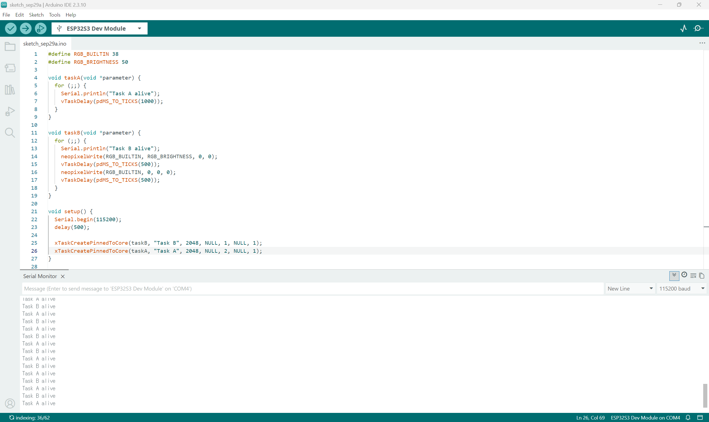

# Hardware and software
- Board: ESP32-S3-DevKitC-1 v1.1
- RGB LED data pin: GPIO 38
- RGB brightness: 50
- Software: Arduino IDE 2.x with “esp32 by Espressif Systems”
- Serial Monitor baud rate: 115200
- Both tasks are pinned to Core 1.

# Prediction and observation table & Priority experiments
## Scenario A. Both tasks at priority 1
### Prediction before test: 
Since Task A and Task B have the same priority, I expect them to execute in the order they appear in the code. Both tasks will repeat continuously because they contain infinite loops. When a task calls vTaskDelay(), it will allow the CPU to switch to another task, making the two tasks appear to run simultaneously.
### Actual observation: 
I added Serial.println("Task B alive"); at the beginning of Task B’s infinite loop to observe the message order. In my test, Task A printed its message first and then called vTaskDelay(), entering the Blocked state for 1000ms. Task B then printed its message, turned the LED on, and entered the Blocked state for 500ms. When this delay expired, Task B became Ready and, when scheduled to run, turned the LED off. It then entered the Blocked state for another 500ms. Around this time, Task A’s 1000ms delay also expired. Task A printed its next message before Task B printed its message and turned the LED on again.
### Did it match? Why?: 
Yes, the observed behaviour matched my prediction. Both tasks ran concurrently, but not in parallel, because they shared the same CPU core, which could execute only one task at a time. When one task entered the Blocked state by calling vTaskDelay(), another Ready task could run. This allowed both tasks to take turns using the CPU and continue their work, making them appear to run simultaneously.

## Scenario B. Task A priority 2; Task B priority 1
### Prediction before test: 
I predict that Task A will run first because it has a higher priority than Task B. Both tasks will repeat continuously because they contain infinite loops. When a task calls vTaskDelay(), it will allow the CPU to switch to another task, making the two tasks appear to run simultaneously. I also expect Task A to run first even if I change the order of the task creation calls, because the tasks now have different priorities.
### Actual observation:
Task A printed its message first and then entered the Blocked state for 1000ms. Task B then printed its message, turned the LED on, and entered the Blocked state for 500ms. When this delay expired, Task B became Ready and, when scheduled to run, turned the LED off. It then entered the Blocked state for another 500ms. Around this time, Task A’s 1000ms delay also expired. Task A printed its next message before Task B printed its message and turned the LED on again. I observed the same behaviour even after changing the order of the task creation calls.
### Did it match? Why?:
Yes, the observed behaviour matched my prediction. Task A had a higher priority, so the scheduler chose Task A first when both tasks were Ready. However, while Task A was blocked by vTaskDelay(), Task B could run even though it had a lower priority. And task A still printed its message every 1000ms because its delay remained unchanged. Both tasks therefore continued to run concurrently, but not in parallel, on the same core.

## Scenario C. Task A priority 1; Task B priority 2
### Prediction before test:
I predict that Task B will run first because it has a higher priority than Task A. Both tasks will repeat continuously because they contain infinite loops. When a task calls vTaskDelay(), it will allow the CPU to switch to another task, making the two tasks appear to run simultaneously. I also expect Task B to run first even if I change the order of the task creation calls, because the tasks now have different priorities.
### Actual observation:
Task B printed its message, turned the LED on, and entered the Blocked state for 500ms. Task A then printed its message and entered the Blocked state for 1000ms. After 500ms, Task B became Ready and, when scheduled to run, turned the LED off. It then entered the Blocked state for another 500ms. Around this time, Task B printed its next message and turned the LED on before Task A printed its next message again. I observed the same behaviour even after changing the order of the task creation calls.
### Did it match? Why?:
Yes, the observed behaviour matched my prediction. Task B had a higher priority, so the scheduler chose Task B first when both tasks were Ready. However, while Task B was blocked by vTaskDelay(), Task A could run even though it had a lower priority. And task B still printed its message every 1000ms and changed LED state every 500ms because its delay remained unchanged. Both tasks therefore continued to run concurrently, but not in parallel, on the same core.

# Starvation experiment
I set Task A’s priority to 2 and Task B’s priority to 1. For this test, I removed vTaskDelay(pdMS_TO_TICKS(1000)); from Task A.
During the test, only “Task A alive” was printed in the Serial Monitor. The LED stayed on and did not blink.
These results suggest that Task B was starved of CPU time. Without the delay, Task A no longer entered the Blocked state for 1000 ms. As long as Task A stayed Ready or Running, Task B could not run because it had a lower priority. The LED kept its previous state even though Task B was not updating it.

# Ready, Running and Blocked explanation
Both tasks shared a single core, so only one task could be Running at a time. Running means that the CPU is executing the task’s code, such as printing a message or turning the LED on or off.
When a task called vTaskDelay(), it entered the Blocked state. It waited without using the CPU, so another Ready task could run. Task A waited for 1000ms. Task B waited for 500ms twice in each loop.
When the waiting time ended, the task became Ready. Ready means that the task can run but is waiting for CPU time. The scheduler chose the Ready task with the highest priority on that core.
In my normal tests, both tasks kept running even with different priorities. When the task with higher priority waited, the other task could run. Both tasks ran about as often as before because their delays stayed the same.
In the starvation test, only “Task A alive” was printed, and the LED stayed on. This suggests that Task B did not get CPU time. I removed Task A’s delay, and Task A had a higher priority than Task B. While Task A was Ready or Running, Task B could not run.
After the temporary starvation test, I restored all delays and checked that both tasks and the LED worked normally again.

# Final restored configuration
- Task A’s priority is 2.
- Task B’s priority is 1.
- Task A waits for 1000 ms in each loop.
- Task B waits for 500 ms twice in each loop.

# Serial Monitor screenshot

