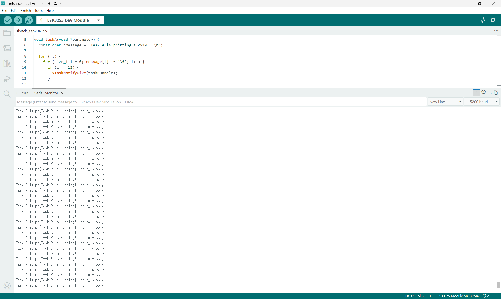

# Assignment purpose
In this assignment, I investigate how the FreeRTOS scheduler selects tasks. I use two tasks pinned to the same ESP32-S3 core and observe:
- the Running, Ready and Blocked states
- the effect of task priorities
- preemption
- the behaviour of tasks with the same priority
The goal is not only to make the program work. I also observe the actual Serial Monitor output and explain how the scheduler behaves in each test.

# Hardware and software
## Hardware
- Board: ESP32-S3-DevKitC-1 v1.1
- Both tasks are pinned to Core 1.
## Software
- Arduino IDE 2.x
- Serial Monitor at 115200 baud

# Your three test scenarios
Both tasks run on the same core. Task A’s priority stays at 1. Only Task B’s priority changes. The notification calls and the rest of the code stay the same.

| Scenario | Task A priority | Task B priority |
| --- | --- | --- |
| A | 1 | 2 |
| B | 1 | 1 |
| C | 1 | 3 |

# Prediction and observation table
## Scenario A
- Task A = priority 1
- Task B = priority 2
### Prediction before test
Since Task B has a higher priority than Task A, I expect Task B to preempt Task A when it receives a notification and becomes Ready.
### Actual observation
When i == 12, Task A sent a notification to Task B. At this point, Task A had printed “Task A is pr”. Task B then printed “[Task B is running!]”. After Task B finished printing and waited for another notification, Task A continued printing the rest of its message, “inting slowly...”.
### Match? Why?
Yes, the result matched my prediction. Task B was initially Blocked, waiting for a notification. When Task A called xTaskNotifyGive(), Task B became Ready. Since Task B had a higher priority, it preempted Task A and became Running. Task A became Ready and waited for CPU time. After printing its message, Task B called ulTaskNotifyTake() and became Blocked again. Task A then returned to the Running state and continued from where it stopped.

## Scenario B
- Task A = priority 1
- Task B = priority 1
### Prediction before test
Since Task A and Task B have the same priority, I do not expect Task B to immediately preempt Task A when it receives a notification and becomes Ready. I expect Task B to run after Task A finishes printing its message and enters the Blocked state.
### Actual observation
When i == 12, Task A sent a notification to Task B. However, Task A continued printing and finished its full message, “Task A is printing slowly...”. Task B then printed “[Task B is running!]”. Unlike Scenario A, Task B’s message did not appear in the middle of Task A’s message.
### Match? Why?
Yes, the result matched my prediction. When Task B received the notification, it changed from Blocked to Ready. Both tasks had the same priority, so Task B did not immediately preempt Task A in my test. Task A finished printing and called vTaskDelay(), entering the Blocked state. Task B then became Running and printed its message. After that, it waited for another notification and became Blocked again.

## Scenario C
- Task A = priority 1
- Task B = priority 3
### Prediction before test
Since Task B has a higher priority than Task A, I expect Task B to preempt Task A when it receives a notification and becomes Ready.
### Actual observation
When i == 12, Task A sent a notification to Task B. At this point, Task A had printed “Task A is pr”. Task B then printed “[Task B is running!]”. After Task B finished printing and waited for another notification, Task A continued printing the rest of its message, “inting slowly...”.
### Match? Why?
Yes, the result matched my prediction. Task B was initially Blocked, waiting for a notification. When Task A called xTaskNotifyGive(), Task B became Ready. Since Task B had a higher priority, it preempted Task A and became Running. Task A became Ready and waited for CPU time. After printing its message, Task B called ulTaskNotifyTake() and became Blocked again. Task A then returned to the Running state and continued from where it stopped.

# Your explanation
Both tasks ran on one CPU core, so only one task could run at a time. The Running state means that a task is currently using the CPU. In the Ready state, a task can run but is waiting for the scheduler to give it CPU time. In the Blocked state, a task is waiting for something, such as a notification or a delay, so the scheduler does not run it.
At the beginning, Task B called ulTaskNotifyTake() and waited for a notification. Therefore, Task B entered the Blocked state. Task A then became Running and printed its message one character at a time.
When i == 12, Task A called xTaskNotifyGive(). In Scenarios A and C, Task B had a higher priority than Task A. Task B changed from Blocked to Ready and preempted Task A. Task A changed from Running to Ready. Task B then became Running and printed “[Task B is running!]”. After printing, Task B waited for the next notification and became Blocked again. Task A resumed from the point where it stopped and continued printing. This produced output such as Task A is pr[Task B is running!]inting slowly...
In Scenario B, both tasks had the same priority. Task B became Ready after receiving the notification, but it did not immediately preempt Task A in my test. Task A finished printing and called vTaskDelay(), so it entered the Blocked state. Task B then became Running and printed its message.
When the delay ended, Task A became Ready again. The scheduler selected a Ready task according to its priority. The tasks ran concurrently because they took turns, but they did not run in parallel because they shared one CPU core.

